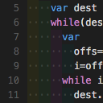
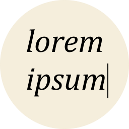
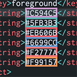

<h3 align="center">
	<br>
	<strong>Classic ASP Language Support for <a href="https://code.visualstudio.com">VSCode</a></strong>
    
</h3>

<p align="center">
    <a href="https://marketplace.visualstudio.com/items?itemName=ashtonckj.classic-asp-language-support"></a>
    <a href="https://marketplace.visualstudio.com/items?itemName=ashtonckj.classic-asp-language-support"></a>
    <a href="https://github.com/ashtonckj/Classic-ASP-Language-Support/issues"></a>
    <a href="https://github.com/ashtonckj/Classic-ASP-Language-Support/LICENSE"></a>
</p>

---

## 📸 See It In Action

> *Using **[Catppuccin Theme](https://github.com/catppuccin/vscode)***

| Formatting Before & After | SQL Syntax Highlighting |
|:------:|:-----:|
|  |  |

---

## 🚀 Quick Start

| Action | Shortcut |
|--------|----------|
| Format document | `Alt + Shift + F` (Win/Linux) · `Option + Shift + F` (Mac) |
| Trigger IntelliSense | `Ctrl + Space` or just start typing |
| Insert snippet | Type prefix → `Tab` |
| Go to definition | `F12` or `Ctrl + Click` |
| Follow include link | `Ctrl + Click` on the file path |

---

## ✨ Features

### 🎨 Smart Formatting
- **Multi-language** — VBScript, HTML, CSS, JavaScript, and SQL in a single keystroke
- **VBScript** — smart indentation across all control structures and multi-block `<% %>` regions
- **HTML/CSS/JS** — formatted by Prettier, fully configurable
- **Keyword casing** — your choice of `PascalCase`, `UPPERCASE`, or `lowercase`

### 💡 IntelliSense & Auto-Completion
- **Context-aware** — correct suggestions whether you're in ASP, CSS, JS, or HTML
- **COM object tracking** — type `rs.` after `Set rs = Server.CreateObject("ADODB.Recordset")` to see all methods and properties
- **Cross-file IntelliSense** — variables and functions from `#include`'d files appear in suggestions automatically
- **File paths** — live browsing inside `#include` and `href`/`src`/`action` attributes

### 🔍 Hover, Definition & Links
- **Hover docs** — inline documentation for keywords, functions, COM members, and CSS properties
- **Go to definition** — `F12` across the current file and all included files
- **Document links** — `Ctrl + Click` navigation on `#include` paths and local file attributes

### 🌈 Syntax Highlighting
- **ASP regions** — toggleable background colouring for `<% %>` blocks, light and dark themes
- **Semantic colouring** — user-defined functions and sub names
- **Smart SQL** — highlights SQL inside strings; plain strings are left untouched

### 🔴 Diagnostics
- **HTML** — mismatched structural tags flagged with orange squiggles
- **VBScript** — unmatched control blocks (`If/End If`, `Sub/End Sub`, `For/Next`, etc.)
- **CSS** — errors and warnings inside `<style>` blocks as you type
- **Void elements** — invalid closing tags caught with a *one-click quick fix*

### ⌨️ Smart Key Handling
- **Context-aware Enter/Tab** — correct indentation inside `<% %>` blocks automatically
- **Auto de-indent** — closing keywords (`End If`, `Next`, etc.) de-indent as you type
- **Auto-close** — HTML and ASP comment blocks close automatically

### 📝 Snippets

<details>
<summary>ASP / VBScript</summary>

| Prefix | Inserts |
|--------|---------|
| `asp` | `<% %>` code block |
| `aspo` | `<%= %>` output expression |
| `rw` | `Response.Write("...")` |
| `rr` | `Response.Redirect("...")` |
| `rf` | `Request.Form("...")` |
| `rq` | `Request.QueryString("...")` |
| `sco` | `Server.CreateObject("...")` |
| `dbconn` | Full ADODB.Connection open/close template |
| `rs` | Full Recordset open → loop → close template |
| `inc` | `<!--#include file="..."-->` |

</details>

<details>
<summary>HTML</summary>

| Prefix | Inserts |
|--------|---------|
| `html5` | HTML5 boilerplate |
| `!` | `<!DOCTYPE html>` |
| `table` | Table with `<thead>` and `<tbody>` |
| `form` | Form with action and method |
| `divc` / `divid` | Div with class / ID |
| `script:src` | External script tag |
| `link:css` | Stylesheet link tag |

</details>

<details>
<summary>JavaScript</summary>

| Prefix | Inserts |
|--------|---------|
| `log` | `console.log()` |
| `fetch` | Fetch API with `.then()` / `.catch()` |
| `listener` | `addEventListener` with handler |
| `gebi` | `document.getElementById()` |
| `qs` | `document.querySelector()` |
| `timeout` | `setTimeout` with callback |

</details>

---

## 🔌 Compatibility

| | Extension | Status | Notes |
|:---:|-----------|:------:|-------|
|  | [Prettier] | ✅ Integrated | Already bundled — no separate install needed |
|  | [Error Lens] | ✅ Compatible | Displays diagnostics inline |
|  | [Auto Rename Tag] | ✅ Compatible | Rename opening/closing HTML tags together |
|  | [GitLens] | ✅ Compatible | Git blame, history, and code insights |
|  | [Indent Rainbow] | ✅ Compatible | Colour-coded indentation levels |
|  | [Lorem Ipsum] | ✅ Compatible | Quick placeholder text insertion |
|  | [Color Highlight] | ✅ Compatible | Highlights CSS colour values inline |
|  | [Better Comments] | ✅ Compatible | Colour-coded comment annotations |
|  | [Inline Bookmarks] | ✅ Compatible | In-editor bookmark tracking |
|  | [HTTP Status Codes] | ✅ Compatible | HTTP status code reference on hover |
|  | [ASP HTML Tag Matcher] | ✅ Compatible | Highlights matching HTML tags in ASP files |
|  | [HTML CSS Support] | ⚠️ Caution | May conflict with built-in HTML completions — but may be fine |
|  | [ASP Classic Support] | ❌ Incompatible | Already integrated into this extension |
|  | [Classic ASP Syntaxes & Snippets] | ❌ Incompatible | Already integrated into this extension |

> 💡 **Bracket pair colourisation** works natively with ASP files — enable it via `editor.bracketPairColorization.enabled` and `editor.guides.bracketPairs` in VS Code settings.

---

## ⚙️ Configuration

<details>
<summary><strong>📋 Full Settings List</strong></summary>

### VBScript Formatting

| Setting | Default | Description |
|---------|---------|-------------|
| `aspLanguageSupport.keywordCase` | `PascalCase` | `lowercase` · `UPPERCASE` · `PascalCase` |
| `aspLanguageSupport.aspTagsOnSameLine` | `false` | Keep `<% %>` on the same line as code |
| `aspLanguageSupport.htmlIndentMode` | `flat` | `flat` — VBScript always at column 0; `continuation` — follows HTML nesting |

### Prettier (HTML/CSS/JS)

| Setting | Default | Description |
|---------|---------|-------------|
| `aspLanguageSupport.prettier.printWidth` | `80` | Wrap lines at this column width |
| `aspLanguageSupport.prettier.tabWidth` | `2` | Spaces per indentation level |
| `aspLanguageSupport.prettier.useTabs` | `false` | Use tabs instead of spaces |
| `aspLanguageSupport.prettier.bracketSameLine` | `false` | Put `>` on last attribute line |
| `aspLanguageSupport.prettier.semi` | `true` | Add semicolons in JavaScript |
| `aspLanguageSupport.prettier.singleQuote` | `false` | Use single quotes in JavaScript |
| `aspLanguageSupport.prettier.arrowParens` | `always` | Arrow function parentheses |
| `aspLanguageSupport.prettier.trailingComma` | `es5` | Trailing comma style |
| `aspLanguageSupport.prettier.endOfLine` | `lf` | Line ending style |
| `aspLanguageSupport.prettier.htmlWhitespaceSensitivity` | `css` | HTML whitespace handling |

### Syntax Highlighting

| Setting | Default | Description |
|---------|---------|-------------|
| `aspLanguageSupport.highlightAspRegions` | `true` | Highlight ASP regions |
| `aspLanguageSupport.bracketLightColor` | `rgba(255, 100, 0, 0.2)` | Bracket colour (light theme) |
| `aspLanguageSupport.bracketDarkColor` | `rgba(0, 100, 255, 0.2)` | Bracket colour (dark theme) |
| `aspLanguageSupport.codeBlockLightColor` | `rgba(100, 100, 100, 0.1)` | Code block colour (light) |
| `aspLanguageSupport.codeBlockDarkColor` | `rgba(220, 220, 220, 0.1)` | Code block colour (dark) |

</details>

---

## 📋 Known Limitations

- ASP blocks must be properly closed (`<% ... %>`) for formatting and diagnostics to work correctly
- Complex mixed HTML/ASP structures may occasionally require manual adjustment after formatting
- `#include virtual="..."` paths are resolved from the first workspace folder root

---

## 🛠️ Development

<details>
<summary><b>Building from Source</b></summary>

**Prerequisites:** Node.js 16+ · VS Code 1.80+

```bash
git clone https://github.com/ashtonckj/Classic-ASP-Language-Support.git
cd Classic-ASP-Language-Support
npm install
npm run compile
# Press F5 in VS Code to launch the Extension Development Host
```
</details>

---

## 🤝 Contributing

Contributions are welcome! If you have ideas, bug reports, or want to improve the extension:

1. 🍴 Fork the repository
2. 🌿 Create a feature branch (`git checkout -b feature/amazing-feature`)
3. 💾 Commit your changes (`git commit -m 'Add amazing feature'`)
4. 📤 Push to the branch (`git push origin feature/amazing-feature`)
5. 🎉 Open a Pull Request

---

## 🙏 Acknowledgements

This extension wouldn't be possible without these amazing projects:

- **[Prettier](https://prettier.io/)** - HTML, CSS, and JavaScript formatting engine
- **Zachary Becknell** ( [ASP Classic Support](https://github.com/zbecknell/asp-classic-support) ) - ASP region highlighting implementation
- **Jintae Joo** ( [Classic ASP Syntaxes and Snippets](https://github.com/jtjoo/vscode-classic-asp-extension) ) - Snippets inspiration and reference

---

<div align="center">

If you find this extension helpful, please consider leaving a ⭐ on GitHub and a rating on the VS Code Marketplace!<br>
**Made with ❤️ for the Classic ASP community**

</div>

[Prettier]: https://marketplace.visualstudio.com/items?itemName=esbenp.prettier-vscode
[Error Lens]: https://marketplace.visualstudio.com/items?itemName=usernamehw.errorlens
[Auto Rename Tag]: https://marketplace.visualstudio.com/items?itemName=formulahendry.auto-rename-tag
[GitLens]: https://marketplace.visualstudio.com/items?itemName=eamodio.gitlens
[Indent Rainbow]: https://marketplace.visualstudio.com/items?itemName=oderwat.indent-rainbow
[Lorem Ipsum]: https://marketplace.visualstudio.com/items?itemName=Tyriar.lorem-ipsum
[Color Highlight]: https://marketplace.visualstudio.com/items?itemName=naumovs.color-highlight
[Better Comments]: https://marketplace.visualstudio.com/items?itemName=aaron-bond.better-comments
[Inline Bookmarks]: https://marketplace.visualstudio.com/items?itemName=tintinweb.vscode-inline-bookmarks
[HTTP Status Codes]: https://marketplace.visualstudio.com/items?itemName=beatzoid.http-status-codes
[ASP HTML Tag Matcher]: https://marketplace.visualstudio.com/items?itemName=sabahweb.asp-html-tag-matcher
[HTML CSS Support]: https://marketplace.visualstudio.com/items?itemName=ecmel.vscode-html-css
[ASP Classic Support]: https://marketplace.visualstudio.com/items?itemName=zbecknell.asp-classic-support
[Classic ASP Syntaxes & Snippets]: https://marketplace.visualstudio.com/items?itemName=jtjoo.classic-asp-html